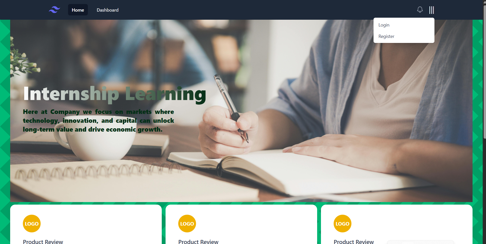
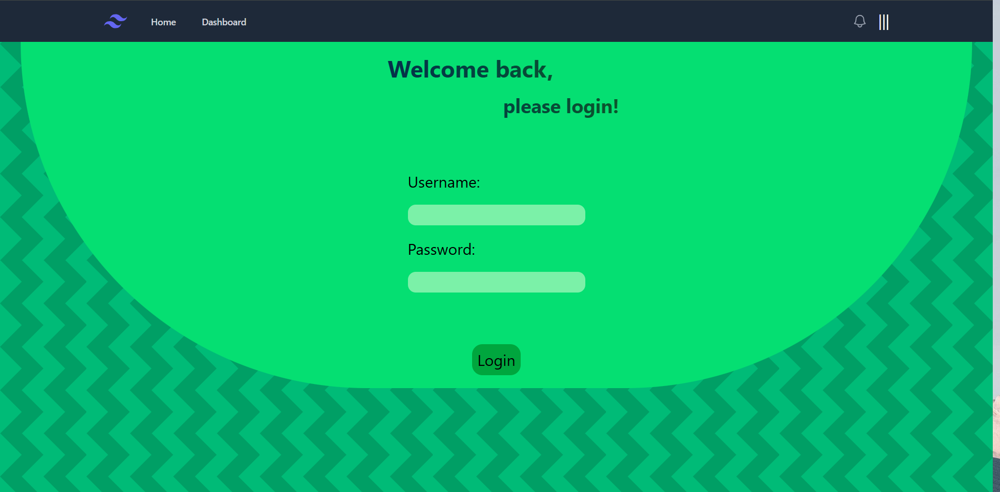
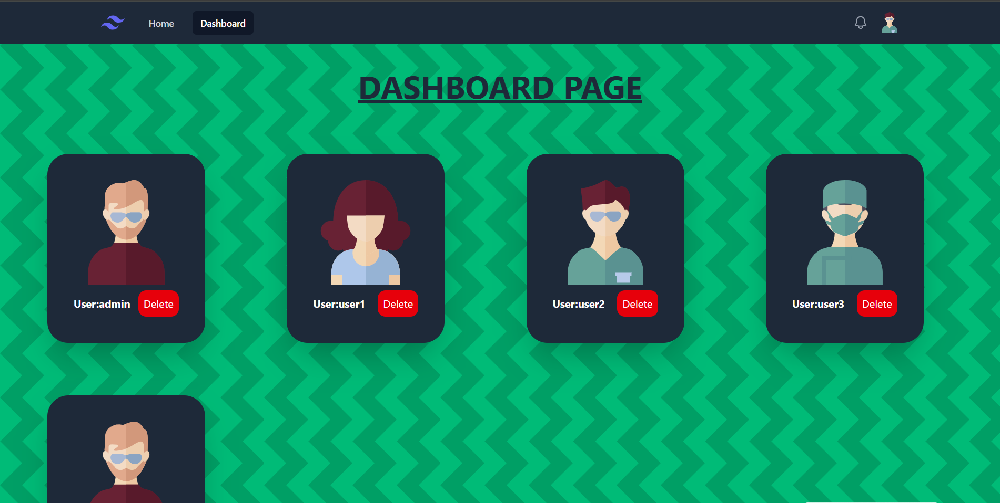
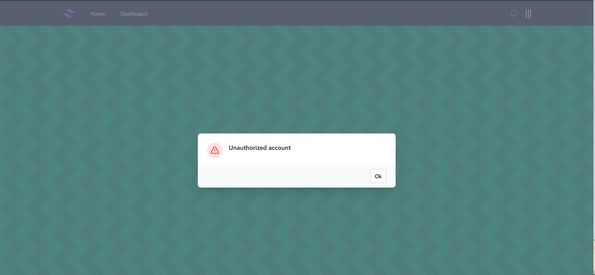

# UsersDashboardPage
<ul>
  <li>
    Project created using .NET and React showcasing JWT based authentication on frontend and backend part, both tested using unit tests.
  </li>
  <li>
    It contains a few precreated users, one of which has access to the dashboard with credentials: "admin" & "admin"
  </li>
  <li>
    The application is dockerized and can be started on any machine.
  </li>
</ul>

# Technologies involved:
<ul>
  <li>
    ASP .NET Core
  </li>
  <li>
    React
  </li>
  <li>
    Vitest
  </li>
  <li>
    Xunit
  </li>
  <li>
    Tailwindcss
</li>
  <li>
    Docker
</li>
</ul>

# Starting
To start the application simply navigate to the project directory where the <b>docker-compose.yml</b> file is located and run the following comand:
<b><i>docker compose up</i></b>

# Showcase
<ul>
  <li>
  
Main page

  
    </li>
   <li>
  
Login page

  
    </li>
   <li>
  
Dashboard page

  
    </li>
   <li>
  
Unauthorized modal

  
    </li>
   <li>
  
Difference in the header between logged users and guests

  
     
    </li>
</ul>
